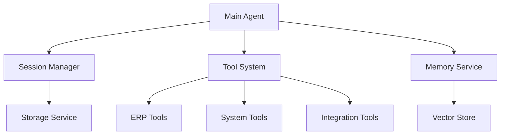

# ERP Management Agent

An intelligent agent system designed to manage and interact with ERP systems through natural language. This agent uses advanced LLM capabilities combined with custom tools to provide an intuitive interface for ERP management tasks.

## Features

### Core System
- 🧠 Advanced LLM-powered reasoning and response generation
- 🛠️ Extensible tool system for custom operations
- 💾 Persistent session management with context isolation
- 🔍 Vector-based memory system for relevant context retrieval

### Current Tools
- `calculator`: Perform mathematical calculations
- `read_file`: Read and analyze code files
- `edit_file`: Make changes to system files
- `manage_session`: Handle conversation contexts

## Installation

1. Clone the repository:
```bash
git clone https://github.com/yourusername/erp-management-agent.git
cd erp-management-agent
```

2. Install dependencies:
```bash
npm install
```

3. Set up environment variables:
```bash
cp .env.example .env
# Edit .env with your API keys and configuration
```

Required environment variables:
- `GROQ_API_KEY`: Your Groq API key
- `PINECONE_API_KEY`: Your Pinecone API key
- `PINECONE_INDEX`: Your Pinecone index name

## Usage

Start the agent:
```bash
npm start
```

### Session Management Commands
- `/new [name]` - Create a new session
- `/switch [id]` - Switch to a different session
- `/list` - List all sessions
- `/clear` - Clear current session history
- `/delete [id]` - Delete a session
- `/help` - Show available commands
- `/exit` - Exit the application

### Example Interactions
```
You> Create a new sales order for customer XYZ
Agent> I'll help you create a sales order. Let me gather the necessary information...

You> Generate a monthly revenue report
Agent> I'll generate a revenue report. Would you like to specify a date range?
```

## Project Roadmap

### Immediate Tasks
- [ ] Database Operations Tool
  - CRUD operations for ERP entities
  - Query builder and executor
  - Transaction management

- [ ] Authentication & Authorization
  - User authentication system
  - Role-based access control
  - Permission management

- [ ] Workflow Management
  - Process automation
  - Task scheduling
  - Workflow templates

- [ ] Integration Tools
  - External API connectors
  - Data import/export
  - Third-party service integration

- [ ] Reporting & Analytics
  - Custom report generation
  - Data visualization
  - Analytics dashboard integration

### Future Enhancements
- [ ] Real-time notifications
- [ ] Document management system
- [ ] Multi-language support
- [ ] Audit logging
- [ ] Mobile interface
- [ ] Batch processing capabilities

## Architecture

The agent is built with a modular architecture:



### Components
- **Session Manager**: Handles conversation contexts and persistence
- **Tool System**: Extensible framework for custom operations
- **Memory Service**: Manages conversation history and context
- **Storage Service**: Handles data persistence
- **Vector Store**: Enables semantic search and retrieval

## Development

### Adding New Tools

1. Create a new tool class extending `BaseTool`:
```javascript
import { BaseTool } from './base.tool.js';

export class MyTool extends BaseTool {
    get name() {
        return 'my_tool';
    }

    get description() {
        return 'Description of what the tool does';
    }

    get parameters() {
        return {
            type: 'object',
            properties: {
                // Define parameters
            },
            required: []
        };
    }

    async execute(params) {
        // Implement tool logic
    }
}
```

2. Register the tool in `tool.registry.js`:
```javascript
registerDefaultTools() {
    this.registerTool(new MyTool());
}
```

## Contributing

1. Fork the repository
2. Create a feature branch
3. Commit your changes
4. Push to the branch
5. Create a Pull Request

## License

MIT License - See LICENSE file for details