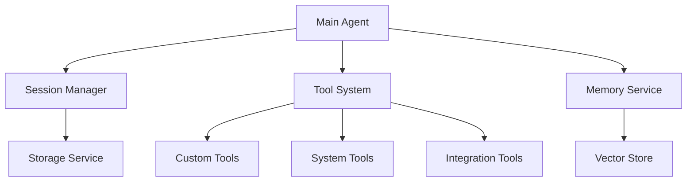

# Intelligent Management Agent

An intelligent agent system that uses advanced LLM capabilities combined with custom tools to provide an intuitive interface for various management and automation tasks.

## Features

### Core System
- 🧠 Advanced LLM-powered reasoning and response generation
- 🛠️ Extensible tool system for custom operations
- 💾 Persistent session management with context isolation
- 🔍 Vector-based memory system for relevant context retrieval

### Current Tools
- `calculator`: Perform mathematical calculations
- `read_file`: Read and analyze code files
- `edit_file`: Make changes to system files
- `manage_session`: Handle conversation contexts

## Installation

1. Clone the repository:
```bash
git clone https://github.com/yourusername/intelligent-management-agent.git
cd intelligent-management-agent
```

2. Install dependencies:
```bash
npm install
```

3. Set up environment variables:
```bash
cp .env.example .env
# Edit .env with your API keys and configuration
```

Required environment variables:
- `GROQ_API_KEY`: Your Groq API key
- `PINECONE_API_KEY`: Your Pinecone API key
- `PINECONE_INDEX`: Your Pinecone index name

## Usage

Start the agent:
```bash
npm start
```

### Session Management Commands
- `/new [name]` - Create a new session
- `/switch [id]` - Switch to a different session
- `/list` - List all sessions
- `/clear` - Clear current session history
- `/delete [id]` - Delete a session
- `/help` - Show available commands
- `/exit` - Exit the application

### Example Interactions
```
You> Analyze the performance metrics for Project X
Agent> I'll help you analyze the performance metrics. Let me gather the necessary information...

You> Generate a summary report for the last quarter
Agent> I'll generate a summary report. Would you like to specify any particular metrics to focus on?
```

## Project Roadmap

### Immediate Tasks
- [ ] Database Operations Tool
  - CRUD operations
  - Query builder and executor
  - Transaction management

- [ ] Authentication & Authorization
  - User authentication system
  - Role-based access control
  - Permission management

- [ ] Workflow Management
  - Process automation
  - Task scheduling
  - Workflow templates

- [ ] Integration Tools
  - External API connectors
  - Data import/export
  - Third-party service integration

- [ ] Reporting & Analytics
  - Custom report generation
  - Data visualization
  - Analytics dashboard integration

### Future Enhancements
- [ ] Real-time notifications
- [ ] Document management system
- [ ] Multi-language support
- [ ] Audit logging
- [ ] Mobile interface
- [ ] Batch processing capabilities

## Architecture

The agent is built with a modular architecture:



### Components
- **Session Manager**: Handles conversation contexts and persistence
- **Tool System**: Extensible framework for custom operations
- **Memory Service**: Manages conversation history and context
- **Storage Service**: Handles data persistence
- **Vector Store**: Enables semantic search and retrieval

## Development

### Adding New Tools

1. Create a new tool class extending `BaseTool`:
```javascript
import { BaseTool } from './base.tool.js';

export class MyTool extends BaseTool {
    get name() {
        return 'my_tool';
    }

    get description() {
        return 'Description of what the tool does';
    }

    get parameters() {
        return {
            type: 'object',
            properties: {
                // Define parameters
            },
            required: []
        };
    }

    async execute(params) {
        // Implement tool logic
    }
}
```

2. Register the tool in `tool.registry.js`:
```javascript
registerDefaultTools() {
    this.registerTool(new MyTool());
}
```

## Contributing

1. Fork the repository
2. Create a feature branch
3. Commit your changes
4. Push to the branch
5. Create a Pull Request

## License

MIT License - See LICENSE file for details