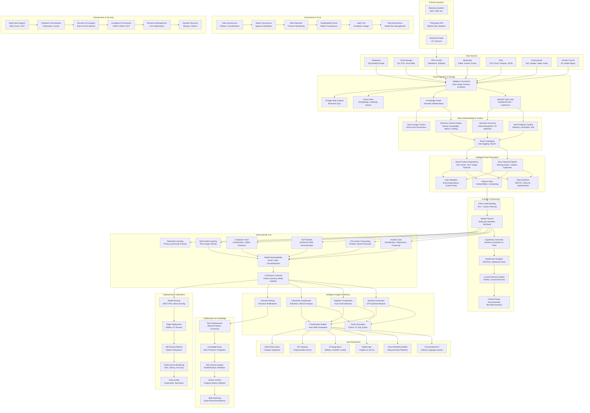

# AI-Driven Data Scientist — Enhanced Architecture

## Executive Summary
An autonomous data science platform that transforms business questions into actionable insights through conversational AI, automated analysis pipelines, and intelligent orchestration. The system reduces time-to-insight from weeks to hours while maintaining enterprise-grade governance and explainability.

## Architecture Overview

## Strategic Differentiators

### 1. **Semantic Intelligence**
- **Business Context Engine**: Understands domain-specific terminology and metrics
- **Intent Inference**: Translates vague business questions into precise analytical workflows
- **Knowledge Graph**: Captures relationships between entities, metrics, and business processes

### 2. **Autonomous Reasoning**
- **Hypothesis-Driven Analysis**: Automatically generates and tests business hypotheses
- **Causal Inference**: Goes beyond correlation to identify causal relationships
- **Multi-modal Intelligence**: Combines structured data with text, images, and time series

### 3. **Collaborative Intelligence**
- **Human-AI Partnership**: Augments rather than replaces data scientists
- **Peer Learning**: System improves from team interactions and feedback
- **Domain Adaptation**: Learns company-specific patterns and preferences

## Technical Innovation Areas

### AI-Native Data Pipeline
- **Self-healing Pipelines**: Automatically detect and fix data quality issues
- **Intelligent Sampling**: Smart data sampling for faster iteration
- **Adaptive Schema Evolution**: Handle changing data structures gracefully

### Advanced Analytics Capabilities
- **Causal AI**: Understand cause-effect relationships, not just correlations
- **Counterfactual Analysis**: "What would happen if..." scenario modeling
- **Time Series Causal Discovery**: Identify causal relationships in temporal data
- **Multi-armed Bandit Optimization**: Continuous A/B testing and optimization

### Next-Generation Explainability
- **Layered Explanations**: From executive summary to technical deep-dive
- **Interactive What-if Analysis**: Real-time model exploration
- **Bias Detection & Mitigation**: Proactive fairness monitoring
- **Confidence Calibration**: Reliable uncertainty quantification

## MVP+ Roadmap

### Phase 1: Foundation (Months 1-4)
- Core data connectors (5 most common sources)
- Basic auto-profiling and cleaning
- Simple AutoML with explainability
- Conversational interface for common queries
- Basic model registry and monitoring

### Phase 2: Intelligence (Months 5-8)
- Semantic discovery and business context
- Hypothesis generation and testing
- Advanced feature engineering
- Multi-modal data support
- Collaborative workspaces

### Phase 3: Autonomy (Months 9-12)
- Causal inference capabilities
- Self-improving pipelines
- Advanced visualization and storytelling
- Production deployment and scaling
- Comprehensive governance framework

### Phase 4: Scale (Months 13-18)
- Federated learning across organizations
- Real-time adaptive models
- Edge deployment capabilities
- Advanced domain specialization
- Ecosystem integrations

## Market Positioning

### Target Segments
1. **Enterprise Data Teams**: 500+ employee companies with existing data infrastructure
2. **Business Analysts**: Non-technical users who need data insights quickly
3. **Consultancies**: Firms delivering data science services to clients
4. **Regulated Industries**: Finance, healthcare, pharma with strict compliance needs

### Competitive Advantages
- **Time to Insight**: 10x faster than traditional approaches
- **Accessibility**: Business users can perform advanced analytics
- **Governance**: Enterprise-ready from day one
- **Explainability**: Built-in transparency and trust

## Key Metrics & Success Criteria

### Technical Metrics
- **Time to First Insight**: < 30 minutes for new datasets
- **Model Accuracy**: Top-quartile performance vs. human data scientists
- **Pipeline Reliability**: 99.5% uptime for production workflows
- **Explainability Coverage**: 100% of models have interpretability reports

### Business Metrics
- **User Adoption**: 80%+ monthly active usage among licensed users
- **Decision Impact**: 25%+ improvement in business metrics
- **Cost Savings**: 60%+ reduction in time-to-insight costs
- **User Satisfaction**: 4.5+ NPS score

## Risk Mitigation Strategies

### Technical Risks
- **Data Quality**: Multi-layer validation and human-in-the-loop verification
- **Model Bias**: Continuous fairness monitoring and bias correction
- **Scalability**: Cloud-native architecture with auto-scaling
- **Security**: Zero-trust architecture with end-to-end encryption

### Business Risks
- **User Adoption**: Extensive change management and training programs
- **ROI Demonstration**: Built-in business impact measurement
- **Competitive Response**: Continuous innovation and platform stickiness
- **Regulatory Compliance**: Proactive compliance framework

## Investment Requirements

### Development (18 months)
- **Core Team**: 25-30 engineers (ML, backend, frontend, data)
- **Infrastructure**: $500K cloud costs for development and testing
- **Third-party Services**: $200K for AI/ML APIs and tools

### Go-to-Market
- **Sales & Marketing**: $2M for team and campaigns
- **Customer Success**: $500K for onboarding and support
- **Partnerships**: $300K for integration and ecosystem development

## Next Steps
1. **Technical Deep-dive**: Detailed component specifications and APIs
2. **Market Validation**: Customer discovery and pilot program design
3. **Team Assembly**: Key hire identification and recruiting strategy
4. **Funding Strategy**: Series A preparation and investor targeting
